# 🛍️ FashionStore Backend - Fashion E-commerce API

**Owner:** [Hieuvolaptrinh](https://github.com/hieuvolaptrinh)

## 📝 Project Description:

**FashionStore Backend** is a robust RESTful API for a modern online fashion e-commerce platform with comprehensive features from customer shopping to complete admin management. The system is built with Spring Boot framework, ensuring high performance, security, and good scalability.

### 🎯 Key Features:

#### 👥 For Customers:

- **Registration/Login:** Secure authentication system with email verification
- **Online Shopping:** Browse products by category, search, filter products
- **Smart Shopping Cart:** Manage products, update quantities, automatic calculation
- **Diverse Payment:** Support VNPAY, direct payment
- **Order Management:** Track order status, purchase history
- **Product Reviews:** Write reviews, view reviews from other customers
- **Account Management:** Update personal information, change password

#### 🔧 For Admin:

- **Dashboard:** Revenue overview, detailed statistics
- **Product Management:** Add, edit, delete, activate/deactivate products
- **Order Management:** Process orders, update delivery status
- **Voucher Management:** Create, update discount codes
- **User Management:** Manage customer and shipper accounts
- **Withdrawal System:** Process withdrawal requests, transaction history
- **Revenue Reports:** Detailed statistics by time period

#### 🚚 For Shipper:

- **Order Management:** Receive and process assigned orders
- **Delivery Tracking:** Update delivery status

## 💻 Technologies Used:

### **Backend Framework:**

- **Java 21:** Latest LTS version with modern features
- **Spring Boot 3.4.3:** Main backend framework with auto-configuration
- **Spring Security 6:** Advanced authentication and authorization management
- **Spring Data JPA:** ORM and database management with Hibernate
- **Spring Data REST:** RESTful API endpoints generation
- **Spring Mail:** Automated email sending system
- **Spring OAuth2 Client:** Google OAuth2 integration
- **Spring Boot DevTools:** Hot reload for development

### **Database & ORM:**

- **Microsoft SQL Server:** Main relational database
- **Hibernate:** JPA implementation for ORM
- **Spring Data JPA:** Repository pattern implementation

### **Security & Authentication:**

- **JWT (JSON Web Token):** Token-based authentication
- **BCrypt:** Password encryption and hashing
- **Spring Security:** Security configuration and filters
- **OAuth2:** Google authentication integration

### **Payment Integration:**

- **VNPAY API:** Vietnamese payment gateway integration
- **RESTful API:** Standard API architecture for payment processing

### **Email & Communication:**

- **Spring Mail:** SMTP email service
- **Gmail SMTP:** Email delivery service
- **HTML Email Templates:** Rich email formatting

### **Development Tools:**

- **Maven:** Dependency management and build tool
- **Lombok:** Code generation for boilerplate reduction
- **Spring Boot Validation:** Input validation and constraints
- **SpringDoc OpenAPI:** API documentation (Swagger)
- **Jackson:** JSON serialization/deserialization

### **Google Cloud Integration:**

- **Google Drive API:** File storage and management
- **Google API Client:** Google services integration
- **Google OAuth Client:** Authentication with Google

### **Additional Libraries:**

- **Dotenv Java:** Environment variables management
- **JJWT:** JWT library for token handling

### �️ Database ERD


## 🚀 Installation and Usage:

### ⚙️ System Requirements:

- **Java:** JDK 21 or higher
- **Maven:** 3.6+ (or use included Maven wrapper)
- **SQL Server:** 2019 or higher
- **RAM:** Minimum 4GB
- **Storage:** 1GB free space

### 📦 Project Installation:

1. **Clone repository:**

   ```bash
   git clone https://github.com/hieuvolaptrinh/FashionStore_BackEnd.git
   cd FashionStore_BackEnd/FashionStore_BackEnd
   ```

2. **Database Setup:**

   ```bash
   # Create database in SQL Server
   # Run the FashionStore.sql script to create database and insert sample data
   sqlcmd -S localhost -d master -i ../FashionStore.sql
   ```

3. **Environment Configuration:**

   Create a `.env` file in the root directory:

   ```bash
   # Database Configuration
   DB_USERNAME=your_sql_server_username
   DB_PASSWORD=your_sql_server_password

   # Email Configuration
   MAIL_USERNAME=your_gmail_address
   MAIL_PASSWORD=your_gmail_app_password

   # VNPAY Configuration
   VNPAY_TMN_CODE=your_vnpay_terminal_code
   VNPAY_HASH_SECRET=your_vnpay_hash_secret

   # Google OAuth2 Configuration
   GOOGLE_CLIENT_ID=your_google_client_id
   GOOGLE_CLIENT_SECRET=your_google_client_secret
   ```

4. **Install Dependencies and Run:**

   ```bash
   # Using Maven wrapper (recommended)
   ./mvnw clean install
   ./mvnw spring-boot:run

   # Or using system Maven
   mvn clean install
   mvn spring-boot:run
   ```

5. **Access API:**
   - Base URL: `http://localhost:8080`
   - API Documentation: `http://localhost:8080/swagger-ui.html`

### 🔧 Configuration Details:

#### Database Configuration:

```properties
spring.datasource.url=jdbc:sqlserver://localhost:1433;databaseName=FashionStore1;encrypt=false
spring.datasource.username=${DB_USERNAME}
spring.datasource.password=${DB_PASSWORD}
spring.jpa.hibernate.ddl-auto=update
```

#### Email Configuration:

```properties
spring.mail.host=smtp.gmail.com
spring.mail.port=587
spring.mail.username=${MAIL_USERNAME}
spring.mail.password=${MAIL_PASSWORD}
```

#### VNPAY Payment Configuration:

```properties
vnpay.vnp_TmnCode=${VNPAY_TMN_CODE}
vnpay.vnp_HashSecret=${VNPAY_HASH_SECRET}
vnpay.vnp_Url=https://sandbox.vnpayment.vn/paymentv2/vpcpay.html
```

### 🧪 Test Accounts:

```bash
# Admin Account
Username: admin
Password: password123
Email: admin@example.com

# User Account
Username: user
Password: password123
Email: user@example.com

# Shipper Account
Username: shipper
Password: password123
Email: shipper@example.com
```

### 💳 VNPAY Test Information:

```bash
Bank: NCB
Card number: 9704198526191432198
Card holder: NGUYEN VAN A
Issue date: 07/15
OTP password: 123456
```

### 🔐 Authentication and Security

#### Login


#### Registration


#### Forgot Password


#### Reset Password


#### Registration Email


#### Password Recovery Email


#### Account Activation Success

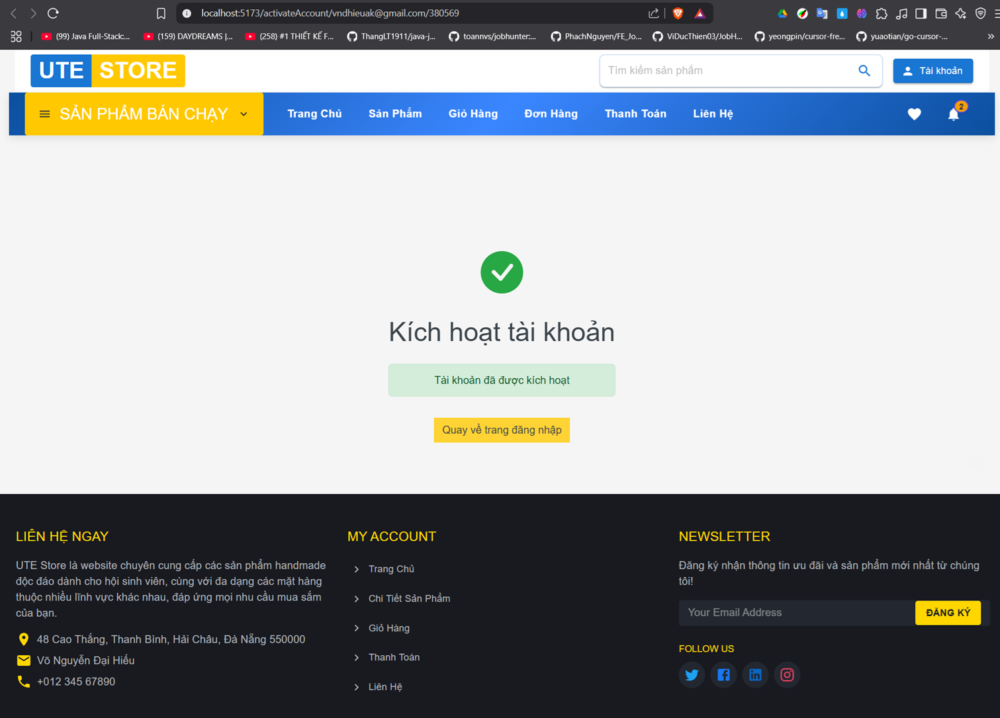

### 🛒 Customer Interface

#### Product Homepage


#### Product Details

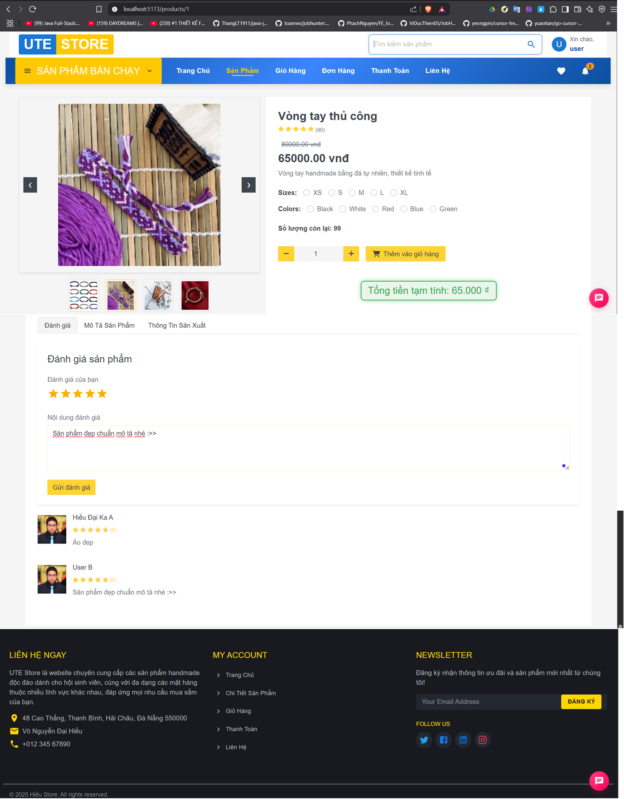

#### Product Description


#### Product Reviews

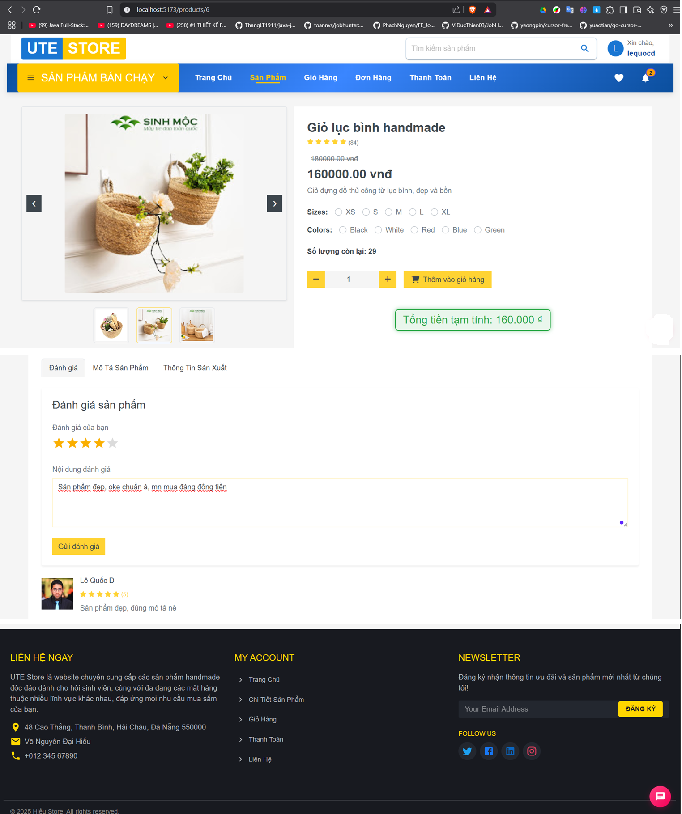

#### Shopping Cart


### 💳 Payment

#### Order Payment


#### Direct Payment


#### VNPAY Payment


#### Payment Success

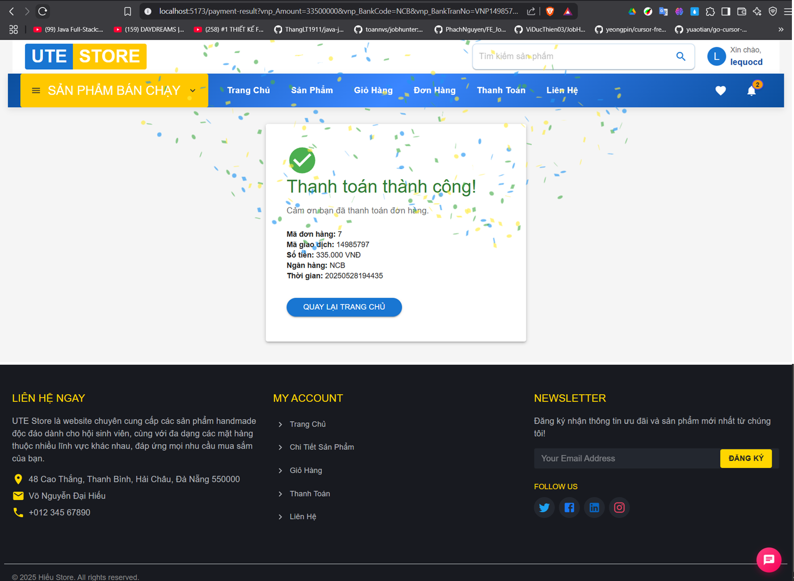

#### Payment Failed


### 👤 Account Management

#### Personal Information


#### Edit Personal Information


#### Edit User Information

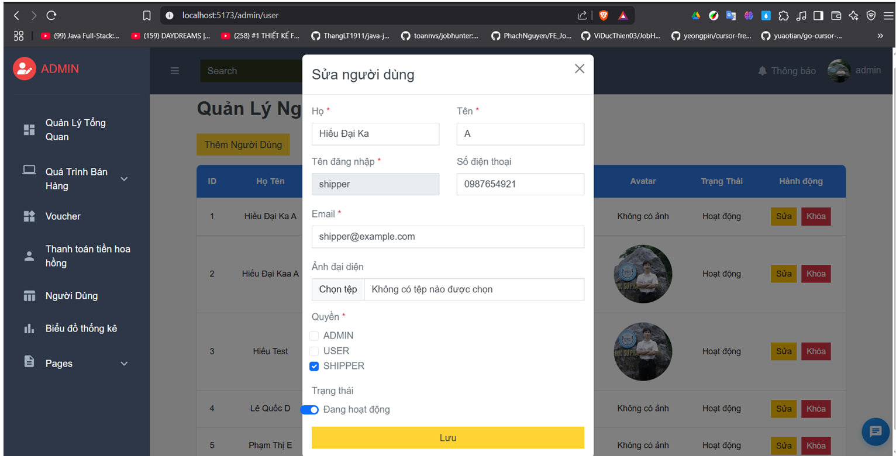

#### Order List


#### View Notifications

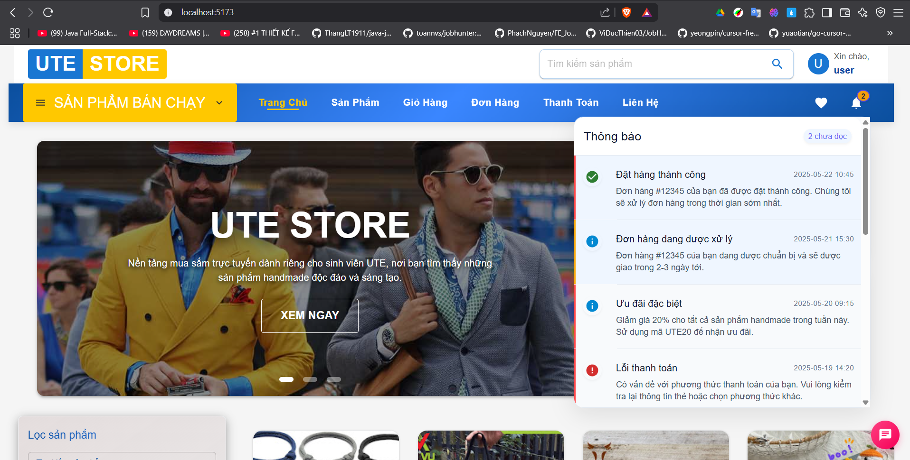

### 🚚 Shipper Interface

#### Received Orders List

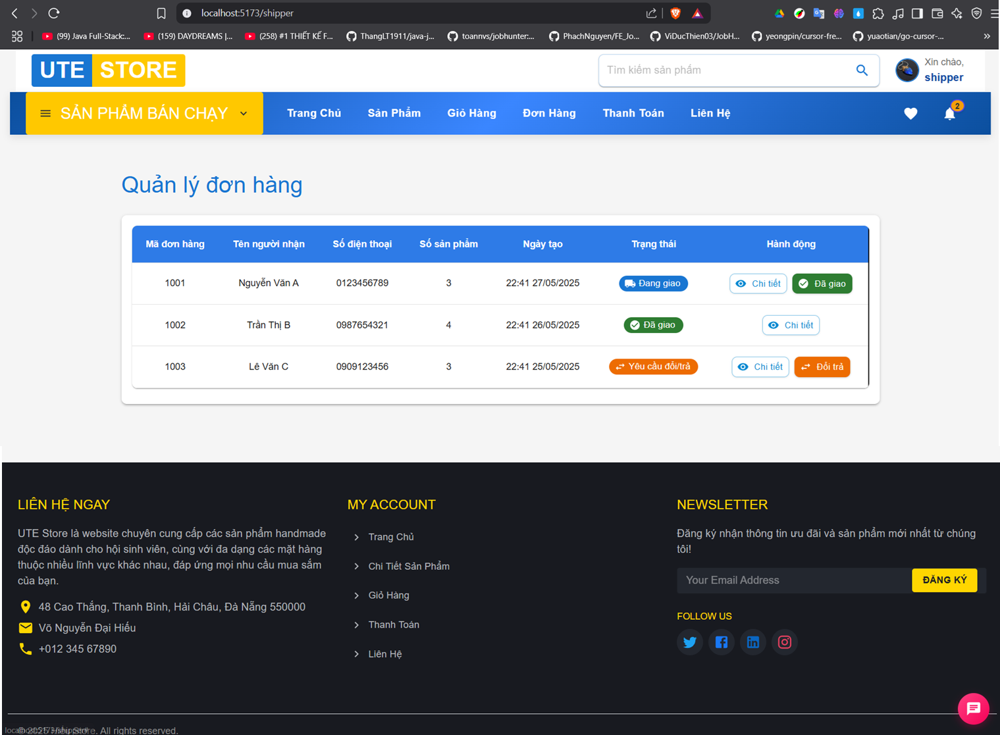

#### Payment History


### 🔧 Admin Interface

#### Revenue Overview


#### Detailed Revenue


#### Product Management


#### Edit Product Information


#### Products on Sale


#### Product Activation Failed


#### Return Product

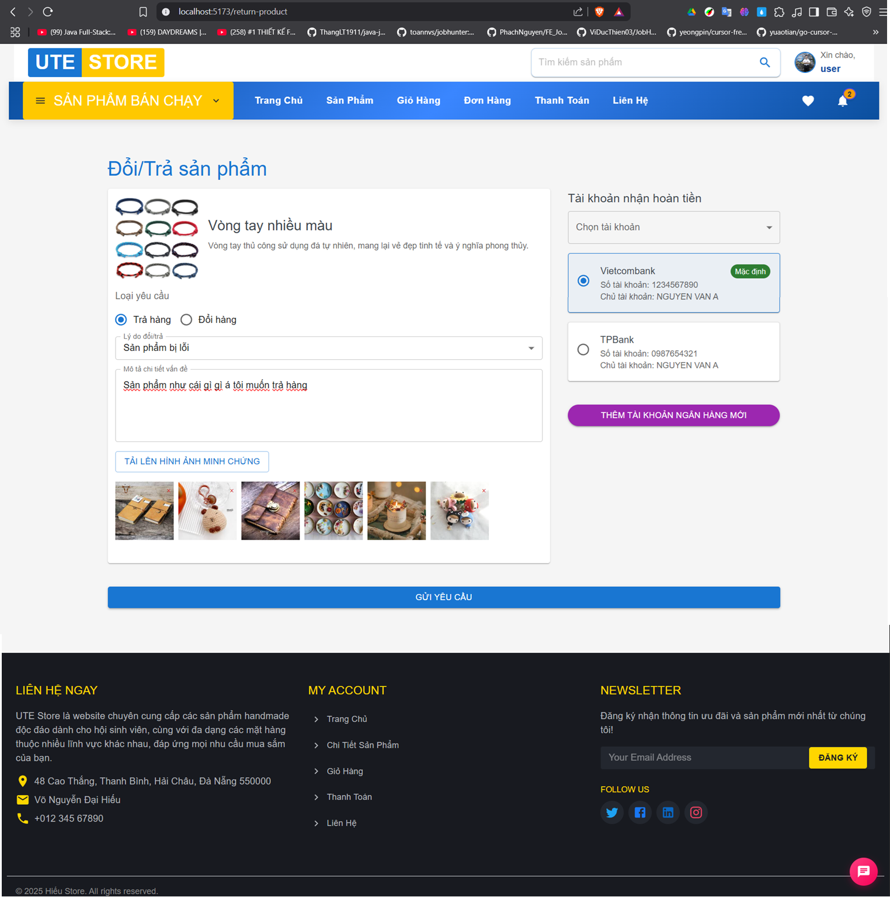

#### Order Management (Admin)


#### Voucher List

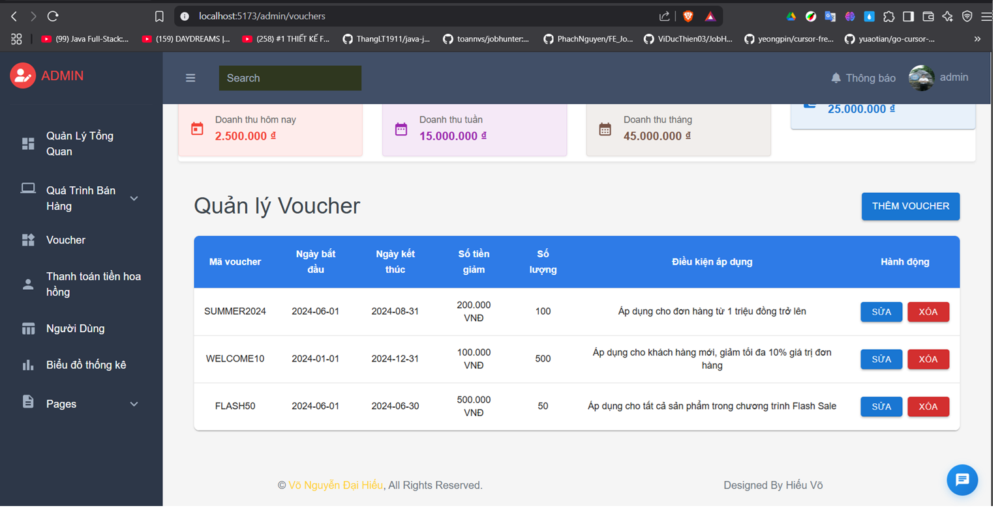

#### Update Voucher

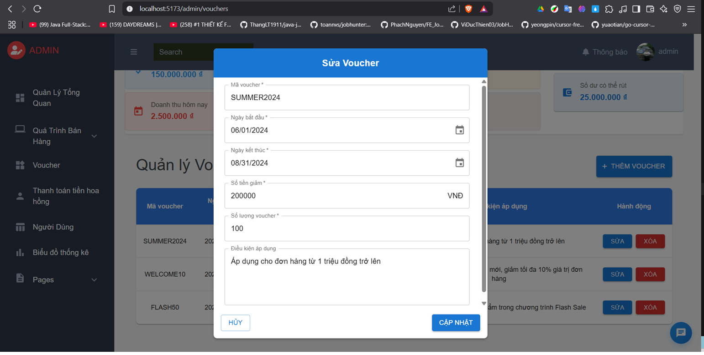

#### User List


#### Withdrawal

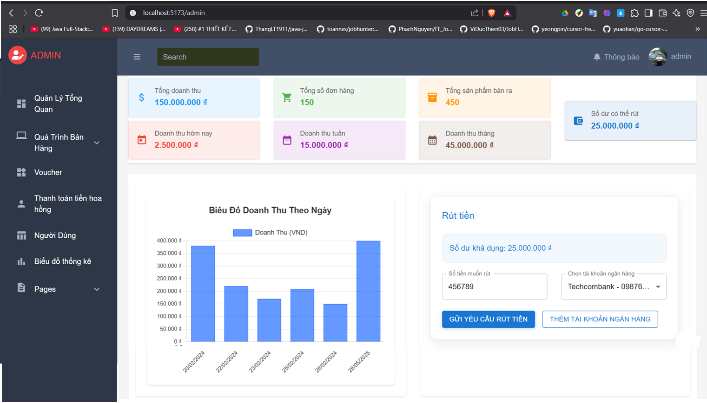

#### Withdrawal History


## 🏗️ Project Structure:

```
FashionStore_BackEnd/
├── src/
│   ├── main/
│   │   ├── java/
│   │   │   └── com/HieuVo/FashionStore_BackEnd/
│   │   │       ├── BookStoreBackEndApplication.java    # Main application class
│   │   │       ├── Config/                            # Configuration classes
│   │   │       │   ├── Endpoints.class               # API endpoints config
│   │   │       │   ├── OAuth2SuccessHandler.class    # OAuth2 handler
│   │   │       │   ├── PasswordEncoderConfig.class   # Password encryption
│   │   │       │   └── SecurityConfiguration.class   # Security config
│   │   │       ├── Controller/                       # REST Controllers
│   │   │       ├── DTO/                             # Data Transfer Objects
│   │   │       ├── Filter/                          # Custom filters
│   │   │       ├── Model/                           # JPA Entity models
│   │   │       ├── Repository/                      # Data repositories
│   │   │       ├── Service/                         # Business logic
│   │   │       └── Util/                           # Utility classes
│   │   └── resources/
│   │       ├── application.properties              # Application configuration
│   │       └── templates/
│   │           └── activation-email.html          # Email templates
│   └── test/                                      # Unit tests
├── target/                                        # Compiled classes
├── FashionStore.sql                              # Database script
├── pom.xml                                       # Maven dependencies
├── mvnw                                          # Maven wrapper (Unix)
├── mvnw.cmd                                      # Maven wrapper (Windows)
└── preview/                                      # Application screenshots
```

## 🔌 API Endpoints:

### Authentication:

- `POST /api/auth/login` - User login
- `POST /api/auth/register` - User registration
- `POST /api/auth/forgot-password` - Forgot password
- `POST /api/auth/reset-password` - Reset password
- `GET /api/auth/activate/{token}` - Account activation

### Products:

- `GET /api/products` - Get all products
- `GET /api/products/{id}` - Get product by ID
- `POST /api/products` - Create new product (Admin)
- `PUT /api/products/{id}` - Update product (Admin)
- `DELETE /api/products/{id}` - Delete product (Admin)

### Orders:

- `GET /api/orders` - Get user orders
- `POST /api/orders` - Create new order
- `PUT /api/orders/{id}` - Update order status
- `GET /api/orders/admin` - Get all orders (Admin)

### Payment:

- `POST /api/payment/vnpay` - Create VNPAY payment
- `GET /api/payment/vnpay-return` - VNPAY return URL
- `POST /api/payment/vnpay-ipn` - VNPAY IPN handler

### Users:

- `GET /api/users/profile` - Get user profile
- `PUT /api/users/profile` - Update user profile
- `GET /api/users/admin` - Get all users (Admin)

### 🔒 High Security:

- JWT token authentication with refresh tokens
- BCrypt password hashing (strength 12)
- OAuth2 integration with Google
- Role-based access control (ADMIN, USER, SHIPPER)
- CORS protection and configuration
- SQL injection prevention with JPA
- Input validation and sanitization

### � Database Features:

- Automatic triggers for cart and order calculations
- Inventory management with real-time updates
- Optimized queries with JPA projections
- Database connection pooling
- Transaction management

### ⚡ Performance Optimizations:

- JPA lazy loading for entities
- Database connection pooling
- Caching with Spring Cache
- Optimized SQL queries
- File upload size limits (60MB)

### � Email Features:

- HTML email templates
- Account activation emails
- Password reset emails
- Order confirmation emails
- SMTP configuration with Gmail

## 🛠️ Available Scripts:

```bash
# Development
./mvnw spring-boot:run         # Run development server
./mvnw clean compile          # Compile project
./mvnw test                   # Run tests
./mvnw clean package          # Build JAR file
./mvnw spring-boot:build-image # Build Docker image

# Database
./mvnw flyway:migrate         # Run database migrations
./mvnw jpa:generate-schema    # Generate database schema

# Production
java -jar target/FashionStore_BackEnd-0.0.1-SNAPSHOT.jar
```

## 📸 Application Interface:

## 🔗 Important Links:

- **Frontend Repository:** [FashionStore_FrontEnd](https://github.com/hieuvolaptrinh/FashionStore_FrontEnd)
- **Backend Repository:** [FashionStore_BackEnd](https://github.com/hieuvolaptrinh/FashionStore_BackEnd)
- **Live Demo:** [Coming Soon]
- **API Documentation:** [Postman Collection](link-to-postman)

## 📋 Roadmap:

### ✅ Completed:

- [x] JWT authentication & authorization system
- [x] RESTful API endpoints for all features
- [x] Product management with categories
- [x] Order processing and management
- [x] Payment integration (VNPAY)
- [x] Email notification system
- [x] Google OAuth2 integration
- [x] Role-based access control
- [x] Database triggers for automation
- [x] File upload support
- [x] API documentation (Swagger)

### 🔄 In Progress:

- [ ] Redis caching implementation
- [ ] Advanced search and filtering APIs
- [ ] Real-time notifications with WebSocket
- [ ] API rate limiting
- [ ] Advanced logging and monitoring

### 📅 Planned:

- [ ] Docker containerization
- [ ] Kubernetes deployment
- [ ] Microservices architecture
- [ ] GraphQL API support
- [ ] Advanced analytics APIs
- [ ] Multi-language support
- [ ] Advanced recommendation algorithms

## 🤝 Contributing:

We always welcome contributions from the community!

### How to contribute:

1. Fork repository
2. Create feature branch (`git checkout -b feature/AmazingFeature`)
3. Commit changes (`git commit -m 'Add some AmazingFeature'`)
4. Push to branch (`git push origin feature/AmazingFeature`)
5. Create Pull Request

### Contribution guidelines:

- Follow coding standards
- Write unit tests for new features
- Update documentation
- Follow commit message convention

## 📄 License:

This project is distributed under the MIT License. See `LICENSE` file for more details.

## 📞 Contact:

- **Developer:** Hieuvolaptrinh
- **Email:** [vndhieuak@gmail.com]
- **GitHub:** [@hieuvolaptrinh](https://github.com/hieuvolaptrinh)
- **Facebook:** [[Hiếu Võ](https://www.facebook.com/HieuVo.hv)]

## 🙏 Acknowledgments:

- Thanks to [React Team](https://reactjs.org/) for the amazing framework
- Thanks to [Spring Boot](https://spring.io/projects/spring-boot) for the powerful backend framework
- Thanks to [VNPAY](https://vnpay.vn/) for the payment gateway
- Thanks to the open source community for useful libraries

---

⭐ **If this project is useful, please give it a Star to support me!** ⭐

- **VIETCOMBANK** >1025212713- Võ Nguyễn Đại Hiếu

---

---

# 🛍️ FashionStore Backend - API Bán hàng thời trang (Tiếng Việt)

**Chủ sở hữu:** [Hieuvolaptrinh](https://github.com/hieuvolaptrinh)

## 📝 Mô tả dự án:

**FashionStore Backend** là RESTful API mạnh mẽ cho nền tảng thương mại điện tử thời trang hiện đại với đầy đủ tính năng từ mua sắm cho khách hàng đến quản lý toàn diện cho admin. Hệ thống được xây dựng với framework Spring Boot, đảm bảo hiệu suất cao, bảo mật và khả năng mở rộng tốt.

## � Cài đặt và sử dụng:

### ⚙️ Yêu cầu hệ thống:

- **Java:** JDK 21 trở lên
- **Maven:** 3.6+ (hoặc sử dụng Maven wrapper đi kèm)
- **SQL Server:** 2019 trở lên
- **RAM:** Tối thiểu 4GB
- **Dung lượng:** 1GB trống

### 📦 Cài đặt dự án:

1. **Clone repository:**

   ```bash
   git clone https://github.com/hieuvolaptrinh/FashionStore_BackEnd.git
   cd FashionStore_BackEnd/FashionStore_BackEnd
   ```

2. **Cài đặt cơ sở dữ liệu:**

   ```bash
   # Tạo database trong SQL Server
   # Chạy script FashionStore.sql để tạo database và dữ liệu mẫu
   sqlcmd -S localhost -d master -i ../FashionStore.sql
   ```

3. **Cấu hình biến môi trường:**

   Tạo file `.env` trong thư mục gốc:

   ```bash
   # Cấu hình Database
   DB_USERNAME=tên_người_dùng_sql_server
   DB_PASSWORD=mật_khẩu_sql_server

   # Cấu hình Email
   MAIL_USERNAME=địa_chỉ_gmail_của_bạn
   MAIL_PASSWORD=mật_khẩu_ứng_dụng_gmail

   # Cấu hình VNPAY
   VNPAY_TMN_CODE=mã_terminal_vnpay
   VNPAY_HASH_SECRET=hash_secret_vnpay

   # Cấu hình Google OAuth2
   GOOGLE_CLIENT_ID=google_client_id
   GOOGLE_CLIENT_SECRET=google_client_secret
   ```

4. **Cài đặt dependencies và chạy:**

   ```bash
   # Sử dụng Maven wrapper (được khuyến nghị)
   ./mvnw clean install
   ./mvnw spring-boot:run

   # Hoặc sử dụng Maven hệ thống
   mvn clean install
   mvn spring-boot:run
   ```

5. **Truy cập API:**
   - Base URL: `http://localhost:8080`
   - Tài liệu API: `http://localhost:8080/swagger-ui.html`

### 🧪 Tài khoản thử nghiệm:

```bash
# Tài khoản Admin
Tên đăng nhập: admin
Mật khẩu: password123
Email: admin@example.com

# Tài khoản User
Tên đăng nhập: user
Mật khẩu: password123
Email: user@example.com

# Tài khoản Shipper
Tên đăng nhập: shipper
Mật khẩu: password123
Email: shipper@example.com
```

### 💳 Thông tin test VNPAY:

```bash
Ngân hàng: NCB
Số thẻ: 9704198526191432198
Chủ thẻ: NGUYEN VAN A
Ngày phát hành: 07/15
Mật khẩu OTP: 123456
```
